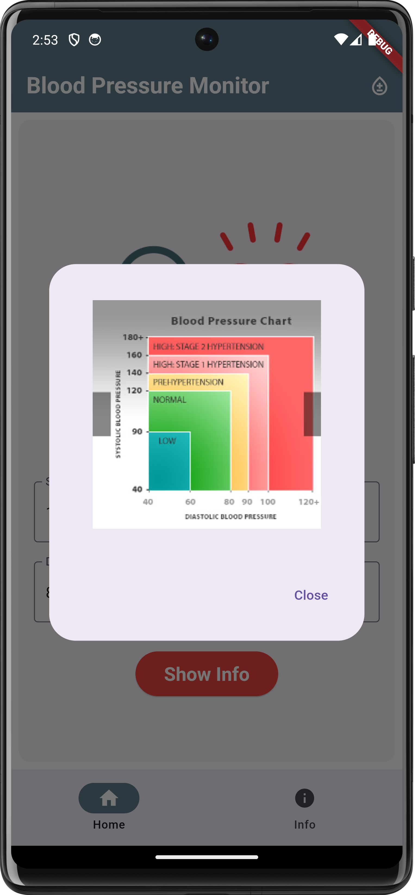

# Blood Pressure Monitor App

## Overview

The Blood Pressure Monitor App is a mobile application developed using Flutter, Material UI, and GetX for state management. It allows users to input their blood pressure readings and classifies these readings into different categories based on standard medical guidelines.

## Features

- **Input Screen:** Users can input their systolic and diastolic blood pressure values.
- **Validation:** The app validates the input values to ensure they are within a reasonable range.
- **Information Screen:** Displays categorized information based on the user’s input values, such as Normal, Elevated, Hypertension Stage 1, Hypertension Stage 2, and Hypertensive Crisis.
- **Navigation:** Smooth navigation between the input screen and the information screen.
- **Widget Hierarchy Diagram:** Detailed diagram of the widget hierarchy used in the app.
- **DartDoc Files:** Generated documentation for the Dart code used in the project.
- **Comprehensive Lessons Learned Section:** A detailed section explaining the lessons learned during the development of the app.

## Key Learning Outcomes

- **Flutter Development:** Utilized Flutter for developing a robust and responsive mobile application.
- **Material UI:** Implemented Material UI components for a clean and user-friendly interface.
- **State Management:** Employed GetX for efficient state management and navigation.
- **Form Validation:** Integrated form validation to ensure accurate and meaningful user input.
- **Documentation:** Generated DartDoc files for comprehensive documentation of the codebase.
- **Version Control:** Used GitHub for version control, including committing changes, managing branches, and collaborating.
- **Health Metrics:** Gained an understanding of blood pressure metrics and their medical significance.

## UI of the App

  
  
  
  

